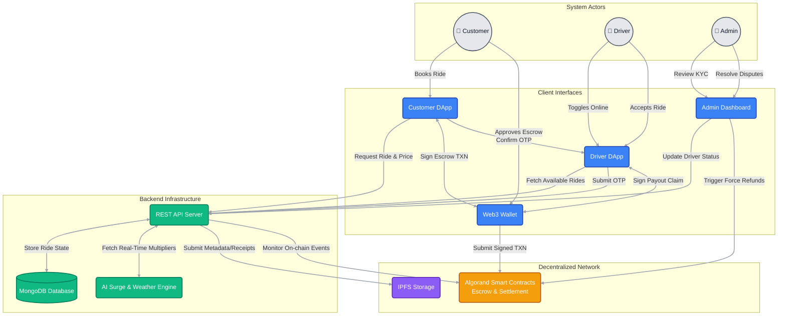

# GigGo System Architecture

The GigGo ecosystem is composed of a decentralized DApp frontend, a backend REST API for indexing and off-chain data, smart contracts on the Algorand blockchain for escrow and dispute resolution, and IPFS for decentralized metadata storage.

## Architecture Flowchart

### Components

- **GigGo Web DApp**: Built with React, Vite, and Tailwind CSS. It handles user authentication, ride requests, driver matching, and wallet connections.
- **REST API**: Built with Node.js and Express. It serves as an indexer for rides, calculates dynamic pricing (surge, weather), handles off-chain coordination (e.g. OTP generation), and logs presence evidence.
- **Algorand Blockchain**: The core of trust. Smart contracts handle ride escrows, locking customer funds upon request, and releasing them to drivers upon successful completion.
- **IPFS**: Used for decentralized storage of driver documents (licenses, ID) and immutable ride receipts.
